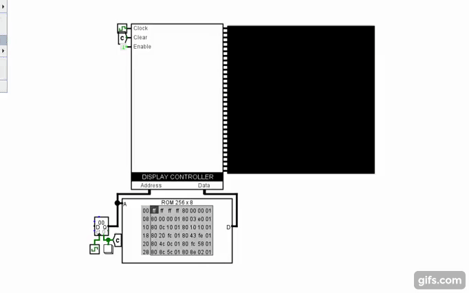

# Controlador-pantalla-logisim
Controlador de pantalla LED de 32 bits en Logisim

## Acerca de Controlador Pantalla Logisim

TODO

## Try the project

TODO

## Usage

[to edit...]

## Contáctame
Hazme saber tus comentarios 😄

- Sígueme en Twitter, comparto mi trabajo como desarrollador  
- ¿Qué te ha gustado del proyecto? 

## Contributing

¡Thank you for considering contributing to the project! 

Feel free to create [a new issue](https://github.com/lmendev/Controlador-pantalla-logisim/issues) with detailed explanation please

## Software requirements

- Logisim-Evolution
- Java

## Installation

* Step 1
* Step 2
